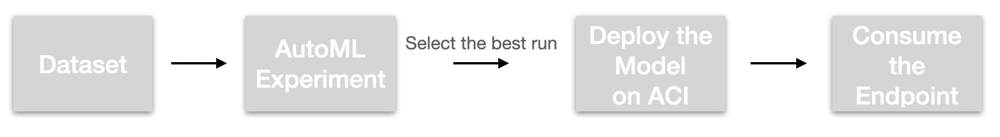
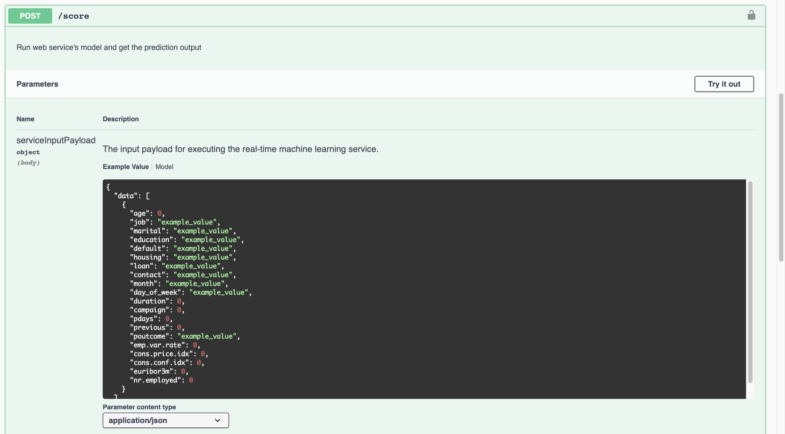
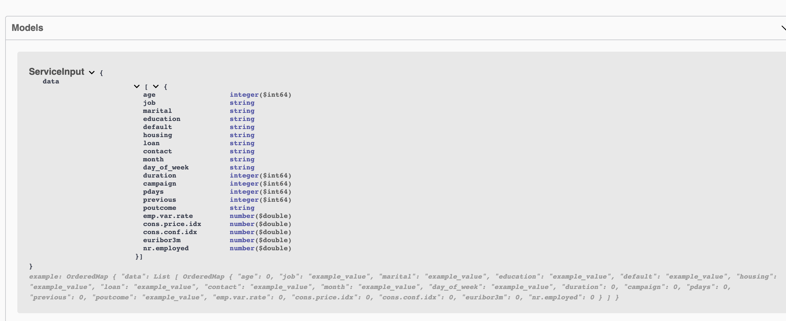
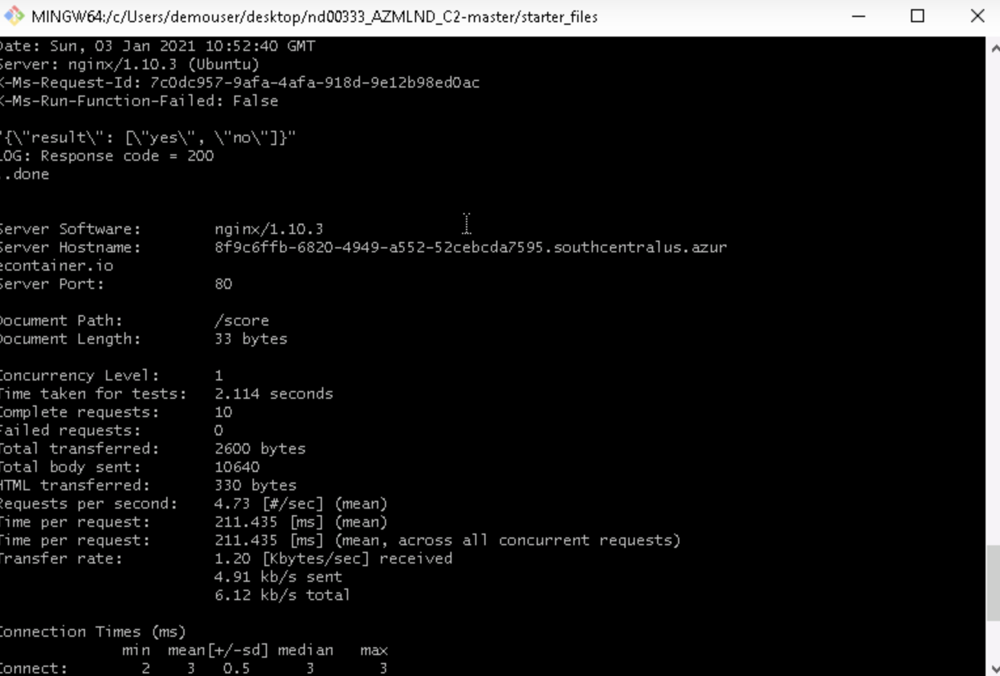
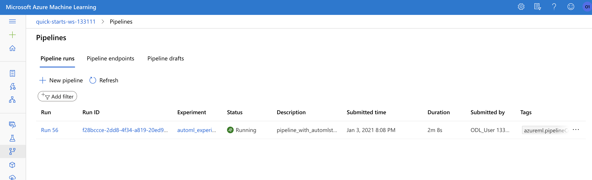
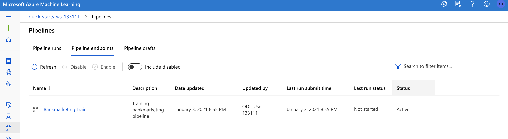
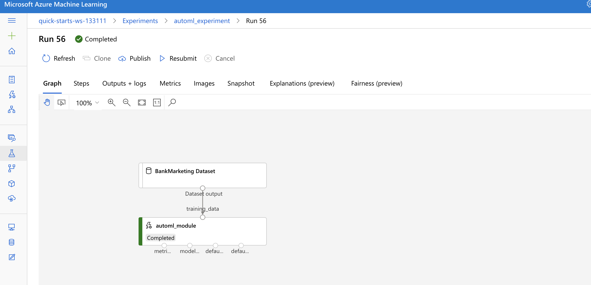
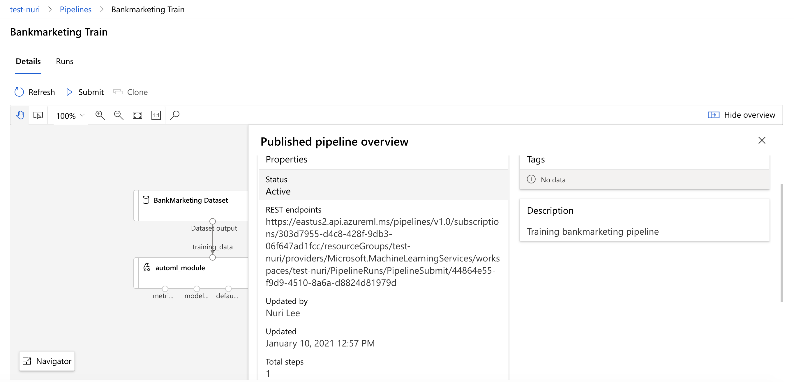
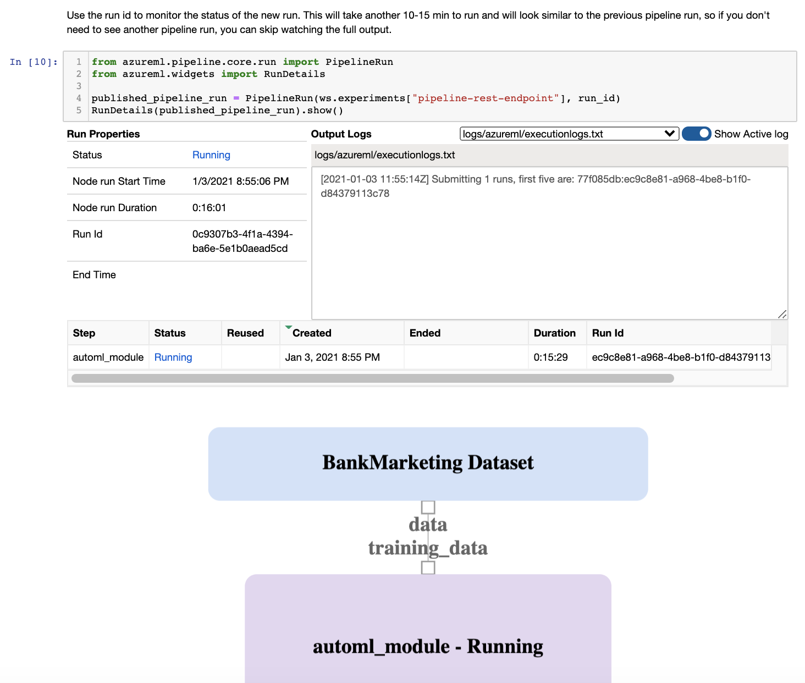
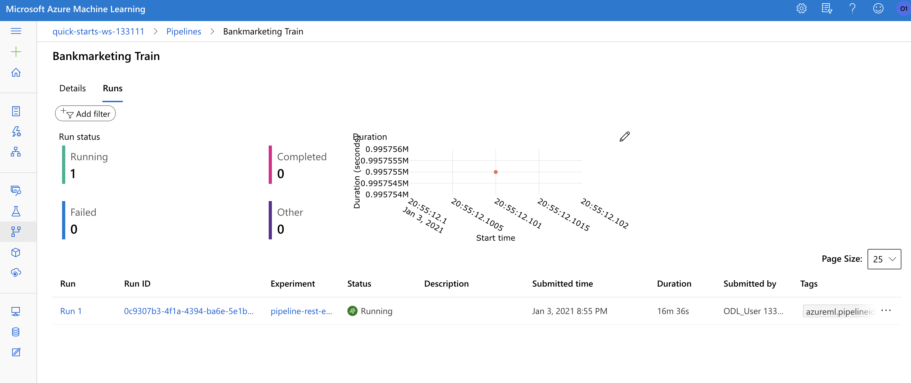

# Microsoft Azure MLOps with Bank Marketing Dataset

## Overview
In this project, we will create, deploy and consume a machine learning model on [Microsoft Azure Machine Learning](https://azure.microsoft.com/en-us/services/machine-learning/). Also we will create, publich and consume a pipeline.

We will follow below steps:

1. Authentication
2. Automated ML Experiment
3. Deploy the best model
4. Enable logging
5. Swagger Documentation
6. Consume model endpoints
7. Create and publish a pipeline

The [dataset](https://archive.ics.uci.edu/ml/datasets/Bank+Marketing) is related with direct phone call marketing campaigns of a Portuguese banking institution to predict whether people subscribe the bank term deposit or not.

For the sample code for this project, you can find from [here](https://github.com/udacity/nd00333_AZMLND_C2/tree/master/starter_files)

There are two approaches for this project. Firstly, we can use Azure ML studio from the consolel to create a new AutoML experiment. Another approach is that we can use [AzureML Python SDK](https://docs.microsoft.com/en-us/python/api/overview/azure/ml/?view=azure-ml-py). and autoamte the task. From Step 2, we will try the console and from step 7, we will use the python sdk.

## Architectural Diagram



After we feed the dataset to AutoML, we can select the best run, deploy this model then finally we can consume the pipeline.

## Key Steps
### Step 1. Authentication

In step 1, we will authenticate and create a Service Principal account and associate it with your specific workspace

1) Install [Azure CLI](https://docs.microsoft.com/en-us/cli/azure/get-started-with-azure-cli)
2) Authenticate to your Azure subscription
`az login command` 
3) Install the Azure Machine Learning extension
`az extension add -n azure-cli-ml`
4) Create the service principal 
`az ad sp create-for-rbac --sdk-auth --name ml-auth`
5) Retrieve the details for the service principal by using the clientId value in 4)
`az ad sp show --id your-client-id`
6) Allow the SP to access your Azure Machine Learning workspace
`az ml workspace share -w your-workspace-name -g your-resource-group-name --user your-sp-object-id --role owner`

You can find more information from [how-to-setup-authentication](https://docs.microsoft.com/en-us/azure/machine-learning/how-to-setup-authentication)

In this step, please ensure that you have installed [AzureML Python SDK](https://docs.microsoft.com/en-us/python/api/overview/azure/ml/install?view=azure-ml-py)

Also please prepare a [config.json](https://docs.microsoft.com/en-us/azure/machine-learning/how-to-configure-environment#workspace) file like below sample. 

```
{
    "subscription_id": "<subscription-id>",
    "resource_group": "<resource-group>",
    "workspace_name": "<workspace-name>"
}
```
Or simply you can download the config.json from the Overview section of your workspace.

### Step 2. Automated ML Experiment

In step 2, we will create an experiment using Automated ML, configure a compute cluster, and use the cluster to run the experiment. Then we will check the best model generated by the AutoML experiment.

1) Upload the bank marketing dataset
- Go to 'Datasets'
- Click 'Create dataset'
- Click 'From web files' or you can upload from local files option.
- Type Name and Web URL https://automlsamplenotebookdata.blob.core.windows.net/automl-sample-notebook-data/bankmarketing_train.csv then click 'Next'
- From Settings and preview, select 'Use headers from the first file' then click 'Next', 'Next' and 'Create'

You can check the registered dataset.


2) Go to 'Automated ML' menu from the left side bar and click 'New Automated ML run'
3) Select the bank marketing dataset
4) Type New experiment name and select 'y' as Target column
5) Create a new compute and then select the compute cluster
- Click select from all options
- Search and select 'Standard_DS12_v2'
- Type Compute name
- Set 1 as the minimum number of nodes 
6) Ensure the task type is Classification and from the Additional configurations, ensure that 'Explain best model' is checked. 
7) From the Exit criterion, set the Training job time as 1 hour
8) From Concurrency, set the max concurrent interations as 5 then finally click 'Finish'

This process takes about 15 minutes and in runs about 5 minutes per iteration.
After the completion of this experiment, you can see the completed screen.


Finally, you can check the best model from the Models tab.


### Step 3. Deploy the Best Model

In step 3, we will deploy the best AutoML Model via Azure Container Instance (ACI)

1) Select the Run for deployment
2) Click 'Deploy' menu to deploy the model and type Name
3) Select Azure Container Instance (ACI) as compute type
4) Enable authentication and click 'Deploy'

### Step 4. Enable Application Insights

In step 4, we will enable Application Insights by running logs.py file and check logs

1) Create a new virtual environment with Python3
- Type `python -m venv ./dev`
- Type `source ./dev/Scripts/activate`
2) Run [logs.py](https://github.com/chamsun-imoggo/udacityms-2ndproject/blob/main/code/logs.py) file. Here, the deployment of the best model name should be matched with your model name. Type `python logs.py`
3) Check whether the 'Application Insights' is enabled or not in the Details tab of the endpoint

4) You can see the logs like below


### Step 5. Swagger Documentation

In step 5, we will consume the deployed model using (Swagger)[https://swagger.io/]

1) From the Details tab of the endpoint, when the Deployment state becomes Healthy, you can copy the Swagger URI.
2) Type `wget <your copied Swagger URI>` or `curl <your copied Swagger URI> --output swagger.json` to download your swagger.json file
3) Type `bash swagger.sh`
You can use this [swagger.sh file](https://github.com/chamsun-imoggo/udacityms-2ndproject/blob/main/code/swagger/swagger.sh) 
4) Open a new terminal (or cmd) and type `python serve.py` you can use this [serve.py](https://github.com/chamsun-imoggo/udacityms-2ndproject/blob/main/code/swagger/serve.py)  file
5) Type `http://localhost` from a browser then you can see the default swagger page
6) Type `http://localhost:8000/swagger.json` then click Explore button then you can see your deployed model's swagger page






### Step 6. Consume Model Endpoints

In step 6, we will run [endpoint.py](https://github.com/chamsun-imoggo/udacityms-2ndproject/blob/main/code/endpoint.py) script to consume model endpoints and we will benchmark the endpoint

1) Replace scoring_uri and key from the endpoint.py file. You can find the information from Endpoints' Consume tab. Copy REST endpoint and Primary key.
2) Type `python endpoint.py`

Then you can see the below json result


3) Type `bash benchmark.sh` then you can check the benchmark result like below



[Apache Benckmark Tool](https://httpd.apache.org/docs/2.4/programs/ab.html) should be installed to run the benchmark.sh script. You can check the installation by running `which ab`

### Step 7. Create and publish a pipeline

In step 7, we will create and publish a pipeline by running this jupyter notebook. Here, you need to update the notebook to have the same keys, URI, dataset, cluster, and model names already created in the previous steps. Also you need to make sure that the config.json file is located in the same directory of this jupyter notebook. Finally run all cells.

1) Created Pipeline


2) Pipeline Endpoint


3) Bankmarketing Dataset


4) Published Pipeline Overview


5) Use RunDetails Widget


6) Scheduled Run


## Screen Recording
Click [Here](https://youtu.be/L9qXJLXIcHQ) to go to the screen recording for this project brief explanation.
- Working deployed ML model endpoint
- Deployed Pipeline
- Available AutoML Model
- Successful API reuqests to the endpoint with a JSON payload

## Standout Suggestions
We conduct the Benchmarking service in this project. It is useful to create a baseline for benchmarks so that we can check the key information related to the performance such as Failed requests, Time per request ...etc

This is conducted by [Apache Benchmark Tool](https://httpd.apache.org/docs/2.4/programs/ab.html)

## Future Work

Based on the best model generated by AutoML, we can create a new model by using the AutoML result. For example, if the best run's algorithm is VotingEnsemble then we can build the VotingEnsemble model and tune the hyperparameters so that we can develop our model based on the insights of AutoML.

You can refer to the [VotingEnsemble scikit-learn](https://scikit-learn.org/stable/modules/generated/sklearn.ensemble.VotingClassifier.html) documentation. Here, you can build your model with HyperDrive. With [HyperDrive](https://docs.microsoft.com/en-us/azure/machine-learning/how-to-tune-hyperparameters), the hyperparmeter optimization can be automated. 

Also we can add more data or try to find out outliers from this dataset for the better model performance. 
